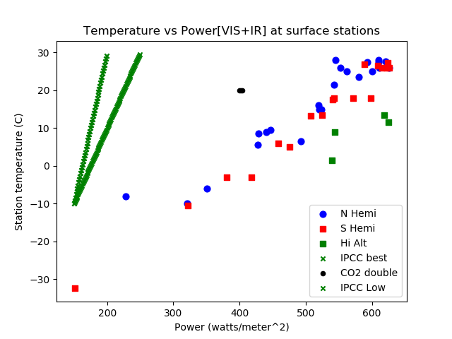

# ClimateSensitivity

Using surface station data to measure climate sensitivity.

We will stipulate as uncontroversial facts that increased carbon dioxide in the atmosphere has a warming effect on the earth's surface.  That effect is  proportional to the logarithm of any concentration change over any period such that a doubling of CO2 adds 3.7 watts per meter squared of radiation downward to the earth's surface.  The resulting formula is

Power = 5.35 ln(c/C0) in watts per meter squared

Now this is not some universal, foundational equation of physics, like conservation of energy, black body radiation and so on.  Clearly there are big problems here if C0, the initial CO2 concentration, is zero. The formula is derived from radiation models which must incorporate assumptions, models, observations about the actions of other (highly non-linear) processes in the atmosphere. This [series](https://scienceofdoom.com/roadmap/co2/) of articles covers the whole topic really well.  The units of power flux are watts per meter squared as a function of latitude, such that they are consistent with and calibrated to the [Trenberth diagram.](https://scied.ucar.edu/radiation-budget-diagram-earth-atmosphere.) Note that the following analysis uses local yearly average powers paired with average temperature whereas Trenberth values are global averages.  

The  interesting and more controversial question is what temperature rise may be expected from this increased radiant heat load.  This git repo implements a simple method to measure climate  sensitivity directly across datasets that contain radiant heat and average surface temperatures at selected sites across both northern and southern hemisphere. The resulting sensitivities range from 0.12 to 0.25 degrees K per watt per meter squared.  In contrast, IPCC claims  that sensitivity is 0.8 +/- 0.4 K per watt per meter squared. Here is an example plot of the data:

Our figure 1 graph, shows GISS station temperature vs. input power. Temperature, latitude, longitude, and elevation data comes [from NASA](https://data.giss.nasa.gov/gistemp/stdata/).  The top of atmosphere (TOA) solar input power is calculated from the tables provided [here](http://applet-magic.com/insolation.htm).  The python program clisen.py

1. Looks up TOA solar power and corrects for cloud reflection and surface reflection.
2. Calculates net IR power and adds to solar power. Net IR is up so it reduces total power.
3. calculates separate sensitivities for northern and southern hemisphere using the three  power methods below.
4. creates scatter plot

The plots illustrate the response we actually see on earth, about 40  degrees C over 140 watts/m2 flux increase. In comparison IPCC low-end and best estimates of climate sensitivity rise 40 and 80 degrees for 100 watts/m2 flux increase.  One can argue IPPC low-end response is seen from poles to maybe the point where ice melts.  But then the temperate and tropic zones short out the signal with rain, wind, and clouds.  For perspective a horizontal line of magnitude 3.7 w/m2 is plotted at 20 C and 40 w/m2.  This is the CO2 doubling from which we are all meant to run from, screaming in horror.

The following table presents the measured temperature sensitivities with three  definitions of input power:

1. Current method removes VIS absorbed and adds in IR heating power down. VIS and IR is matched to Trenberth 161 and 333 w/m^2.  This is the dataset in the graph. 
2. Original calc was All visible power not reflected,i.e. VIS power absorbed was included in total.

  Hemisphere|VIS+IR|VIS+Ab|units|
 --|------|---|-----|
 N|0.269|0.181|K / (w/m^2)|
 S|0.295|0.212|K / (w/m^2)|

One great advantage of this method is that there is plenty of signal here.  Temperature ranges across 40 degrees K and power ranges over 200 watts per meter squared. Disputes over small adjustments in temperature, common when looking at time series temperature data to tease out the magnitude of CO2 driven warming,  will not have much effect on these measured sensitivities.  Reviewers or critics might come forward with some valid criticisms of how power numbers are calculated, but it will be hard to change the results much as all powers (VIS, IR up and down) go down as absolute value of latitude increases.

With first release power is calculated as the sum of VIS + IR power.  As I said before this was added 'Adding in downward IR is likely to reduce sensitivity since inevitably there is more IR heating in the hot, wet tropics than the cold, dry poles.' This improvement resulted in sensitivities just over half of VIS only sensitivities.  The albedo correction, surface reflection in Trenberth diagram, is based on latitude from this [table](http://www.climatedata.info/forcing/albedo/).  I would like to replace it with something that uses, say ISCCP satellite data or the mix of land types and land to sea ratios in the region of influence around a given station.  The reflection correction is based on[ NASA numbers](https://www.giss.nasa.gov/research/briefs/rossow_01/distrib.html) and again could benefit by satellite or other local data. IR power lookup via [science of doom.](https://scienceofdoom.com/2010/07/17/the-amazing-case-of-back-radiation/)

What can account for the differences between sensitivities obtained here and the IPCC numbers, which are famously derived from models with significant, amplifying feedbacks on CO2 driven warming?  It is uncontroversial that the climate systems has potential feedbacks that are positive, i.e. amplify CO2 driven warming, and also negative, attenuating feedbacks that counteract CO2 driven warming. The controversy is over what the relative magnitudes of these feedbacks are.  Another great advantage of this method is that all feedbacks are necessarily integrated and superposed into the measured data. Arguments that CO2 IR warming carries some special amplifying inducing properties that raw solar and H2O IR do not will be a hard sell to people with solid understandings of basic physics.    

The station data is summarized in csv files for each hemisphere plus the High altitude dataset.. Clisen.py uses [pandas](https://pandas.pydata.org) to read in the files. Note that the power data in the files is not used.  Power is calculated based on latitude. pdfs of each station historical record of temperature are archived in the tempdata folder.

I should note that stations were selected to cover as wide a range of the globe as possible with a strong bias towards stations at or near sea level, given the constraints of NASA GISS data coverage. The most outstanding exception to this criteria is the Anmundsen Scott station at the South Pole at an elevation of 2835 meters elevation.  This station's temperature is corrected back to sea level using lapse rate of ~2C per 300 meters.  Next highest elevation station is Bangalore at 920 meters. Its GISS temperature is not corrected.

Spent some time in Andes around Quito Ecuador and it gave me the thought that up and down the Andes was a good place to measure climate sensitivity at high altitude.  This was the genesis of a third dataset of high altitude locations that is now on the plot.  NASA GISS does not have any stations below Colombia at high altitude in South America, so for now it is a small dataset with the stations in Colombia and some in Himalayas.

This whole exercise was inspired by this [blog post](https://wattsupwiththat.com/2017/01/05/physical-constraints-on-the-climate-sensitivity/) on climate sensitivity which demonstrates a strong fit between a simple gray body model of earth's atmosphere and ISCCP satellite data on clouds and radiation in and out of atmosphere.

Climate sensitivity, the derivative of seasonally averaged temperature  wrt  seasonally avergaed power is a continuous function across the globe and through time. It is also, for all practical purposes, [continuously differentiable](https://en.wikipedia.org/wiki/Smoothness.  The ratio of temperature change to power change from the poles to the equator is a ground truth refutation of  IPCC alarmist sensitivities.

This [news release](https://www.llnl.gov/news/cloudy-feedback-global-warming) provides further evidence of the role of clouds in short circuiting CO22 driven warming. Careful readers will note an almost perfectly soviet perversion of scientific method in the news release, necessary to avoid climate heresy.

