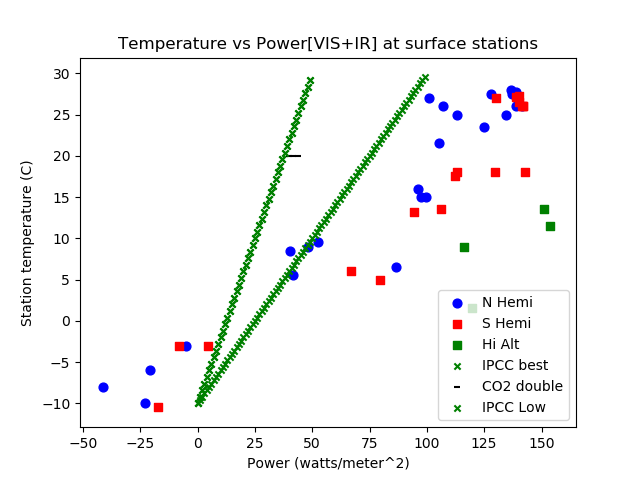

# ClimateSensitivity

Using surface station data to measure climate sensitivity.

We will stipulate as uncontroversial facts that increased carbon dioxide in the atmosphere has a warming effect on the earths surface.  That effect is  proportional to the logarithm of any concentraion change over any period such that a doubling of CO2 adds 3.7 watts per meter squared of radiation downward to the earths surface.  The resulting formula maybe expressed as

Power = 5.35 ln(c/C0) in watts per meter squared

An interesting and more controversial question is what temperature rise may be expected from this increased radiant heat load.  This repo implements a simple method to measure climate  sensitivty directly across datasets that contain radiant heat and average surface temperatures at selected sites across both northern and southern hemisphere. The resulting sensitvities range from 0.14 to 0.21 degrees K per watt per meter squared.  In contrast, IPCC has suggested that sensitivty is 0.8 +/- 0.4 K per watt per meeter squared. Here is an example plot of the data:

Temperature, lattitude, longtiude, and elevation data comes [from NASA](https://data.giss.nasa.gov/gistemp/stdata/).  The raw solar input power is calculated from the tables provided [here](http://applet-magic.com/insolation.htm).  The python program clisen.py calculates separate sensitivities for northern and southern hemisphere using both raw solar power and power corrected for albedo. The raw power produces slight higher sensitivities as the albedo correction has the effect of increasing input power differences from polar area to equator.  Teh following table shows the caluclated sensitivies for raw and corrected power.

   |raw|corrected|
 --|------|-----|
 NH|0.156|0.156|
 SH|0.189|0.164|

One great advantage of this method is that there is plenty of signal here.  Temperature ranges across 60 degrees K and power ranges over 250 watts per meter squared. Disputes over samll adjustments in temperature, common when looking at time series temperature data to tease out the magnitude of CO2 driven warming,  will not have much effect on these measured sensitivities.  Revviewers or critics might come foreward with some valid criticisms fo how power numbers are calcualted.  For example one can argue we need a different, better albedo correction or we need to incorporate downward IR power into radiant heat numbers.  But again neither of those will change the range of the results significantly. Adding in downward IR is likely to reduce sensitivity since inevitably there is more IR heating in the hot tropics than the cold poles.  The albedo correction I use is based on lattitude from this table.  I would like to replace it with something that uses, say ISCCP satellite data or the mix of land types and land to sea ratios in the region of influence around a given station.

What can account for the differences between sensitivities obtained here and the IPCC numbers, which are famously derived from models with significant, amplifying feedbacks on CO2 driven warming?  It is uncontroversial that the climate systems has potential feedbacks that are positive, i.e. amplify CO2 driven warming, and also negative atennuating feedbacks that counteract CO2 driven warming.  Another great advantage of this method is that all feedbacks are necessarily integrated and superposed into the measured data. Arguments that CO2 IR warming carries some special amplifying inducing properties that raw solar does not would be a hard sell to people with solid understandings of basic physics.    

The station data is summarized in csv files for each hemishpere. Clisen.py uses [pandas](https://pandas.pydata.org) to read in the files.  pdfs of each station historical record of temperature are archived in the tempdata folder. 

Thsi whole exercise was Inspired by this [blog post](https://wattsupwiththat.com/2017/01/05/physical-constraints-on-the-climate-sensitivity/) on climate sensitivty which demonstrates a strong fit between a simple gray body model of eath's atomosphere and satellite ISCCP data on clouds and radiation in and out of atmosphere.